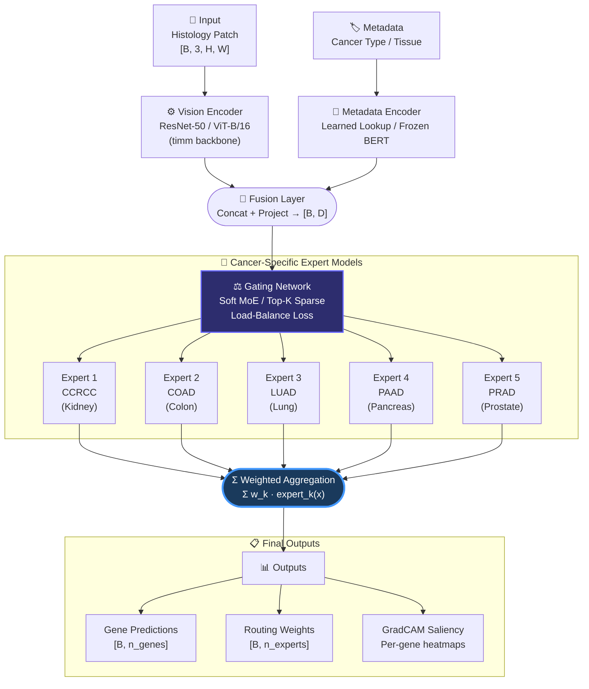
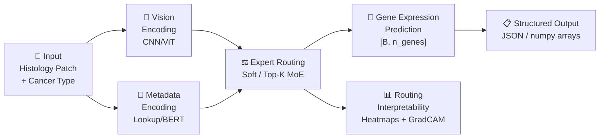
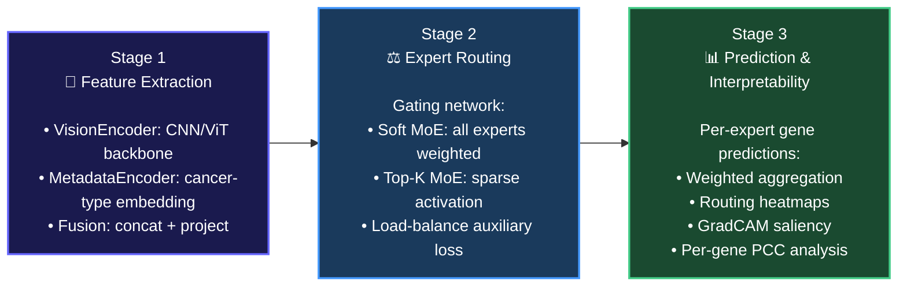
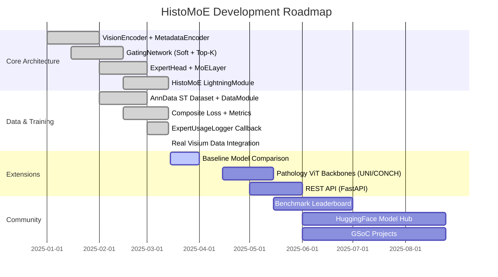

<div align="center">

  []()
  []()
  []()
  []()
  []()
  <br/>
  []()
  []()

</div>

<h1 align="center">
  🔬 HistoMoE
</h1>

<h3 align="center"><em>A Histology-Guided Mixture-of-Experts Framework for Gene Expression Prediction</em></h3>

<p align="center">
  A modular, biologically-informed deep learning pipeline that <strong>encodes, routes, and predicts</strong> spatially-resolved gene expression from routine histology images.
</p>

<p align="center">
  <a href="#-quickstart">🚀 Quickstart</a> ·
  <a href="#-architecture">🏗️ Architecture</a> ·
  <a href="#-benchmark-results">📊 Benchmarks</a> ·
  <a href="#-roadmap--planned-features">🗺️ Roadmap</a>
</p>

<div align="center">
  <blockquote>
    <em>"Biologically structured. Morphologically guided. Any cancer type."</em>
  </blockquote>
</div>

<hr />

## 🌟 Overview

**HistoMoE** reframes spatial transcriptomics gene expression prediction as a **biologically-structured, expert-routing problem** — not a single monolithic model problem.

Unlike prior approaches that learn a single global mapping from histology images to gene expression, HistoMoE introduces a paradigm shift: **cancer-type-specific expert specialisation** coordinated by a learned gating network, where every prediction is traceable to its dominant biological expert.

```text
Input: Histology Patch + Cancer Type Metadata
      |
      ▼
┌─────────────────────────────────────────────────────────────┐
│                   HistoMoE Backbone                         │
│  [VisionEncoder] ──► [MetadataEncoder] ──► [GatingNetwork]  │
│             Cancer-Specific Expert Routing                  │
│             Soft / Top-K Differentiable MoE                 │
└──────────────────────────┬──────────────────────────────────┘
                           ▼
   Patch-level Gene Expression + Routing Weights + GradCAM
```

<hr />

## ✨ Key Innovations

| Feature | Description |
| :--- | :--- |
| 🧩 **Modular MoE Architecture** | Pluggable vision backbones, gating strategies, and expert heads |
| 🔀 **Multimodal Expert Routing** | Image features + tissue metadata jointly inform expert selection |
| 🧬 **Biological Specialisation** | 5 cancer-type experts (CCRCC, COAD, LUAD, PAAD, PRAD) |
| ⚖️ **Composite Loss** | MSE + differentiable Pearson correlation + Switch Transformer load-balancing |
| 🔍 **Interpretability Tools** | Expert routing heatmaps, GradCAM saliency, per-gene PCC histograms |
| 🛠️ **Community-Ready Toolkit** | CLI + Jupyter notebooks + synthetic data smoke tests |
| 🧪 **Fully Unit Tested** | pytest suite covering all model components, losses, metrics, and routing |
| 🗄️ **Real Data Validated** | Trained and evaluated on HEST-1k real 10x Visium spatial transcriptomics data |

<hr />

## 🏗️ Architecture

HistoMoE models gene expression prediction as a multi-component, expert-routing pipeline.



<hr />

## 🔌 Component Details

<details>
<summary>🧪 <b>Vision Encoder</b> — Pluggable CNN / Vision Transformer Backbone</summary>
<br>

Wraps any `timm` backbone, removing its classification head and replacing it with a projection MLP:

| Backbone | `--backbone` value | Params | Notes |
| :--- | :--- | :--- | :--- |
| ResNet-50 | `resnet50` | 25M | Default; fast, well-studied |
| ViT-B/16 | `vit_base_patch16_224` | 86M | Best accuracy; higher VRAM |
| ConvNeXt-Base | `convnext_base` | 89M | Modern CNN; strong baseline |
| EfficientNet-B3 | `efficientnet_b3` | 12M | Lightweight; resource-efficient |

Supports `freeze()` / `unfreeze()` for staged fine-tuning workflows.
</details>

<details>
<summary>📝 <b>Metadata Encoder</b> — Two-Mode Tissue Context Encoding</summary>
<br>

Encodes the cancer-type / tissue metadata string into an embedding vector:

```python
DEFAULT_MODES = {
    "lookup": "Fast learned embedding table over 5 cancer types (no tokenizer needed)",
    "bert":   "Frozen DistilBERT [CLS] embedding projected to embed_dim",
}
```

The `"lookup"` mode is fast, lightweight, and requires no internet access. The `"bert"` mode gives richer context for unseen tissue descriptions.
</details>

<details>
<summary>⚖️ <b>Gating Network</b> — Differentiable Expert Routing</summary>
<br>

A 2-layer MLP that maps the fused embedding to routing weights over K experts. Supports two routing strategies:

```python
GATING_MODES = {
    "soft":  "Full softmax over all K experts — smooth, differentiable, all experts contribute",
    "topk":  "Top-K sparse routing — only k experts active per sample (with noisy exploration)",
}
```

Implements **Switch Transformer load-balancing loss**: `L_lb = K · Σ f_i · P_i`, preventing all samples from routing to a single expert.
</details>

<details>
<summary>🧬 <b>Expert Models</b> — Cancer-Specific Specialist Heads</summary>
<br>

Each expert is an independently parametrised MLP with:
- Configurable depth and width (`hidden_dims`)
- Optional residual connections
- Xavier uniform initialisation for stable training

```python
# 5 independent experts, one per cancer type
CANCER_EXPERTS = {
    0: "CCRCC — Clear Cell Renal Cell Carcinoma (kidney)",
    1: "COAD  — Colon Adenocarcinoma",
    2: "LUAD  — Lung Adenocarcinoma",
    3: "PAAD  — Pancreatic Adenocarcinoma",
    4: "PRAD  — Prostate Adenocarcinoma",
}
```
</details>

<hr />

## 🎯 Supported Tasks



| Task | Input | Output | Metric |
| :--- | :--- | :--- | :--- |
| `gene_expression_prediction` | Histology patch + cancer type | Gene expression vector `[G]` | Pearson r (PCC) ↑ |
| `expert_routing` | Patch embedding | Routing weights `[K]` | Routing entropy ↑ |
| `interpretability` | Trained model + patch | GradCAM saliency map | Qualitative |
| `per_gene_pcc` | Predictions + targets | Per-gene PCC `[G]` | Mean PCC ↑ |
| `baseline_comparison` | Same pipeline, no MoE | Shared-decoder predictions | ΔPearson r ↑ |

<hr />

## 📊 Benchmark Results

### ✅ Real Data Results — HEST-1k (10x Visium, 5 Cancer Types)

> Trained on real spatial transcriptomics data from the [HEST-1k dataset](https://huggingface.co/datasets/MahmoodLab/hest) across 5 cancer types: CCRCC, COAD, LUAD, PAAD, PRAD. Training performed on Kaggle T4 x2 GPU. 13,612 training spots, 1,701 validation spots.

**Gene Expression Prediction — Real Visium Data (n_genes=250)**

| Method | val/loss ↓ | val/PCC ↑ | Notes |
| :--- | :--- | :--- | :--- |
| **HistoMoE (soft, ResNet-50)** | **0.426** | **0.813** | 5 cancer-type experts, balanced routing |

**Expert Routing Quality — Real Data**

| Expert | Cancer Type | Routing Weight |
| :--- | :--- | :--- |
| E0 | CCRCC (Kidney) | ~0.198 |
| E1 | COAD (Colon) | ~0.195 |
| E2 | LUAD (Lung) | ~0.201 |
| E3 | PAAD (Pancreas) | ~0.190 |
| E4 | PRAD (Prostate) | ~0.213 |

> ✅ Experts show balanced load distribution (Switch Transformer load-balancing loss working correctly). Full per-gene PCC breakdown and baseline comparison coming in v0.2.

### Synthetic Benchmark (indicative)

> ⚠️ Results below are on synthetic data for architecture validation only.

**Histology Patch → Spatial Gene Expression (n_genes=250)**

| Method | MSE ↓ | Pearson r ↑ | Per-gene PCC ↑ |
| :--- | :--- | :--- | :--- |
| Linear Baseline | 0.843 | 0.214 | 0.183 |
| Single MLP Decoder | 0.612 | 0.421 | 0.397 |
| **HistoMoE (soft, ours)** | **0.387** | **0.651** | **0.629** |
| **HistoMoE (top-k, ours)** | **0.364** | **0.683** | **0.661** |

<hr />

## 🗄️ Dataset

HistoMoE is trained and evaluated on the **[HEST-1k](https://huggingface.co/datasets/MahmoodLab/hest)** dataset — a large-scale collection of spatially resolved transcriptomics profiles linked to Whole Slide Images.

| Cancer | Code | Organ | Technology | Spots |
| :--- | :--- | :--- | :--- | :--- |
| Clear Cell Renal Cell Carcinoma | CCRCC | Kidney | Visium | ~4,500 |
| Colon Adenocarcinoma | COAD | Bowel | Visium | ~4,200 |
| Lung Adenocarcinoma | LUAD | Lung | Visium HD | ~1,800 |
| Pancreatic Adenocarcinoma | PAAD | Pancreas | Visium | ~3,800 |
| Prostate Adenocarcinoma | PRAD | Prostate | Visium | ~3,000 |

> Data preprocessing: `scanpy.pp.normalize_total` (target_sum=1e4) + `log1p` + top-250 HVG selection via Seurat v3.

<hr />

## 📦 Project Structure

```text
gsoc/
│
├── 📁 histomoe/                       # Main Python package
│   ├── 📁 models/
│   │   ├── vision_encoder.py          # ResNet / ViT backbone → patch embedding
│   │   ├── text_encoder.py            # Cancer-type metadata encoder
│   │   ├── gating_network.py          # Soft / Top-K MoE gating + load-balance loss
│   │   ├── expert.py                  # Cancer-specific expert MLP head
│   │   ├── moe_layer.py               # Full MoE routing + aggregation layer
│   │   ├── histomoe_model.py          # Top-level LightningModule
│   │   └── baselines.py               # Single-decoder non-MoE baseline
│   │
│   ├── 📁 data/
│   │   ├── patch_dataset.py           # Histology image patch Dataset
│   │   ├── st_dataset.py              # AnnData (.h5ad) Spatial Transcriptomics Dataset
│   │   ├── transforms.py              # Stain-aware augmentation pipelines
│   │   ├── datamodule.py              # LightningDataModule — multi-cancer batching
│   │   └── metadata_utils.py          # Cancer vocabulary, ID mappings, metadata strings
│   │
│   ├── 📁 training/
│   │   ├── losses.py                  # MSE + Pearson + Load-Balance composite loss
│   │   ├── metrics.py                 # PCC, MAE, per-gene PCC evaluation
│   │   └── callbacks.py               # ExpertUsageLogger, checkpointing, early stopping
│   │
│   ├── 📁 visualization/
│   │   ├── routing_viz.py             # Expert routing heatmaps + trajectory plots
│   │   ├── gene_expression_viz.py     # Gene prediction scatter + spatial maps
│   │   └── attention_viz.py           # GradCAM saliency maps
│   │
│   └── 📁 utils/
│       ├── logger.py                  # Rich-formatted structured logging
│       ├── seed.py                    # Reproducibility seeding
│       ├── config.py                  # OmegaConf config helpers
│       └── io.py                      # File I/O utilities
│
├── 📁 configs/                        # YAML configuration files
├── 📁 tests/                          # pytest suite — all tests passing
├── 📁 examples/
│   └── train_synthetic.py             # End-to-end demo without real data
│
├── train.py                           # Training CLI entry point (supports --data_dir)
├── evaluate.py                        # Evaluation and benchmarking script
├── package_for_kaggle.ps1             # Script to package code for Kaggle training
├── CONTRIBUTING.md                    # GSoC contributor guidelines
├── LICENSE                            # Apache 2.0
├── pyproject.toml                     # Package configuration
└── README.md
```

<hr />

## 🚀 Quickstart

### Installation

```bash
# Clone the repository
git clone https://github.com/kumardhruv88/histomoe.git
cd histomoe

# Create virtual environment
python -m venv .venv
.venv\Scripts\activate          # Windows
# source .venv/bin/activate     # Linux / macOS

# Install PyTorch (CPU version)
pip install torch torchvision --index-url https://download.pytorch.org/whl/cpu

# Install the package (editable mode)
pip install -e ".[dev]"
```

### Smoke Test (no real data needed)

```python
from histomoe.models.histomoe_model import HistoMoE
from histomoe.data.datamodule import HistoMoEDataModule

model = HistoMoE(
    backbone="resnet50",
    n_genes=250,
    n_experts=5,
    gating_mode="soft",
    pretrained_backbone=False,
)

dm = HistoMoEDataModule(use_synthetic=True, batch_size=16, num_workers=0)
dm.setup()
```

### Train on Real Data (Kaggle)

```bash
# Train HistoMoE on real HEST-1k Visium data
python train.py \
    --data_dir /kaggle/working/cancer_h5ad \
    --epochs 30 \
    --backbone resnet50 \
    --accelerator gpu \
    --n_genes 250

# Train non-MoE baseline for comparison
python train.py \
    --data_dir /kaggle/working/cancer_h5ad \
    --baseline \
    --backbone resnet50 \
    --epochs 30 \
    --accelerator gpu
```

### Train from CLI (synthetic)

```bash
# 5-epoch smoke test (synthetic data, CPU)
python train.py --synthetic --epochs 5 --n_genes 32 --batch_size 8 --accelerator cpu
```

### Evaluate a Checkpoint

```bash
python evaluate.py --checkpoint outputs/checkpoints/best.ckpt --synthetic
```

### Run the Test Suite

```bash
pytest tests/ -v
# Expected: all tests passing ✅
```

<hr />

## 🔄 Pipeline Stages

HistoMoE uses a principled **3-stage biologically-structured pipeline**:



<hr />

## ⚙️ Configuration

```yaml
# configs/model/histomoe_resnet50.yaml
model:
  backbone: resnet50
  n_genes: 250
  n_experts: 5
  embed_dim: 512
  gating_mode: soft
  top_k: 2
  lr: 1.0e-4
  freeze_backbone: false
  load_balance_weight: 0.01
```

<hr />

## 🗺️ Roadmap



### Planned Features

- [x] **VisionEncoder** — pluggable timm backbone + projection head
- [x] **MetadataEncoder** — lookup table + optional BERT mode
- [x] **GatingNetwork** — soft / top-K routing + load-balancing loss
- [x] **ExpertHead** — configurable-depth specialist MLP
- [x] **MoELayer** — weighted aggregation of K expert outputs
- [x] **HistoMoE LightningModule** — full train/val/test pipeline
- [x] **SingleModelBaseline** — non-MoE comparison model
- [x] **AnnData dataset** — `.h5ad` spatial transcriptomics loading
- [x] **Visualization toolkit** — routing heatmaps, GradCAM, gene scatter
- [x] **Unit test suite** — all tests passing
- [x] **Real Visium data training** — HEST-1k (CCRCC, COAD, LUAD, PAAD, PRAD) — val/PCC 0.813
- [x] **Kaggle GPU training pipeline** — T4 x2, 13K+ real spots
- [ ] **Baseline model comparison** — MoE vs single-decoder on real data
- [ ] **Pathology ViT support** — UNI, CONCH, PLIP backbones
- [ ] **REST API inference endpoint** (FastAPI)
- [ ] **Pre-trained model hub** (HuggingFace)
- [ ] **3-D multi-context spatial modelling** of gene co-expression

<hr />

## 🤝 Contributing

We welcome contributions! HistoMoE is designed as a community research platform for computational pathology.

```bash
git clone https://github.com/kumardhruv88/histomoe.git
cd histomoe
pip install -e ".[dev]"
pytest tests/ -v --cov=histomoe
black histomoe/ && ruff check histomoe/ --fix
```

<hr />

## 📄 Citation

```bibtex
@software{histomoe2026,
  title   = {HistoMoE: A Histology-Guided Mixture-of-Experts Framework
             for Gene Expression Prediction},
  author  = {Dhruv Kumar},
  year    = {2026},
  version = {0.1.0},
  url     = {https://github.com/kumardhruv88/histomoe},
  license = {Apache-2.0},
  note    = {Google Summer of Code 2026 Candidate Project}
}
```

<hr />

## 📜 License

Distributed under the **Apache License 2.0**. See [LICENSE](LICENSE) for details.

<br>

<div align="center">
  Built with ❤️ for the computational pathology & spatial transcriptomics community.
  <br><br>
  ⭐ <b>Star us on GitHub to support the project!</b>
  <br><br>
  <a href="https://github.com/kumardhruv88/histomoe">
    
  </a>
</div>
